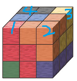

# 주사위 풀이

### [문제 링크](https://www.acmicpc.net/problem/1041)


### 문제 풀이
문제를 풀기 위해서는 주사위가 동시에 몇 가지 면이 보일 수 있는지 찾아야 한다.
또한 각 주사위 면의 합의 최솟값과 개수를 구해야 한다. 
주사위로 N*N*N 크기의 정육면체를 만듦으로 주사위는 최대 3가지 면만 볼 수 있다.
즉 아래와 같이 3가지 경우로 주사위를 배치할 수 있다.
1. 주사위가 1면만 보이게 배치하는 경우
2. 주사위가 2면만 보이는 경우
3. 주사위가 3면만 보이는 경우

+ 주사위 3면의 개수
  + 주사위가 3면만 보이게 배치하는 경우는 4개가 된다.</br>
   </br>
  위 그림과 같이 정육면체의 윗면의 코너부분 4곳이 3면이 보이는 장소이다.
  

+ 주사위 3면의 합의 최솟값
  + 3면이 보이는 주사위의 최솟값은 모서리를 공유하는 세면의 합의 최솟값과 같다.
    즉 마주 보는 면을 제외한 나머지 면과는 3면이 동시에 보일 수 있다.
    이 말은 마주 보는 면중에서 최솟값만을 선택한 면의 합이 3면의 최솟값이 된다는 것이다.

+ 주사위 2면의 개수
  + 윗면의 개수 (n-2) * 4
  + 옆면 코너 기둥 4개, (n-1) * 4
  + 총 합 개수: 8N - 12

+ 주사위 2면의 최솟값
  + 2면이 동시에 보이는 경우는 마주 보는 면을 제외한 모든 면과 가능하다.

+ 주사위 1면의 개수
  + 윗면 개수: (n-2)(n-2)
  + 옆면 개수: (n-1)(n-2)*4
  + 총 개수 : 5n^2 -16n + 12

+ 주사위 1면의 최솟값
  + 6면 중에서 가장 작은 수를 구한다.

N이 1일 때는 주사위가 1개이므로 가장 큰 주사위면을 제외한 5면의 합을 구한다.
### 소스 코드
```java
public class 주사위 {
    public static void main(String[] args) {
        /*
        규칙
        3면만 보이는 주사위 :4, 마주 보는 면만 제외하고, 3면의 합중 가장 작은 값 구하기
        2면만 보이는 주사위의 개수 : 8N-12;
        1면만 보이는 주사위의 개수 : 4*(n-2)(n-1) + (n-2)(n-2) = (n-2)(5n-6) = 5n^2- 16n +12;
         */
        Scanner sc = new Scanner(System.in);
        long N = sc.nextInt();
        int[] diceNum = new int[6];
        for (int i = 0; i < 6; i++) {
            diceNum[i] = sc.nextInt();
        }
        if (N == 1){
            Arrays.sort(diceNum);
            System.out.println(Arrays.stream(diceNum).sum() - diceNum[5]);
            return;
        }

        long sum = 0;
        long sides1min = 50;
        for (int i = 0; i < 6; i++) {
            sides1min = Math.min(diceNum[i], sides1min);
        }
        sum += sides1min * ((5 * N *N) - 16 *N + 12);
        long sides2min = 100;
        for (int i = 0; i < 6; i++) {
            for (int j = i + 1; j < 6; j++) {
                if (j != 5-i) {
                    sides2min = Math.min(diceNum[i] + diceNum[j], sides2min);
                }
            }
        }
        sum += sides2min * (8*N - 12);
        long sides3min = 0;
        for (int i = 0; i < 3; i++) {
            sides3min += Math.min(diceNum[i], diceNum[5-i]);
        }
        sum += sides3min * 4;

        System.out.println(sum);
        
    }
}
```