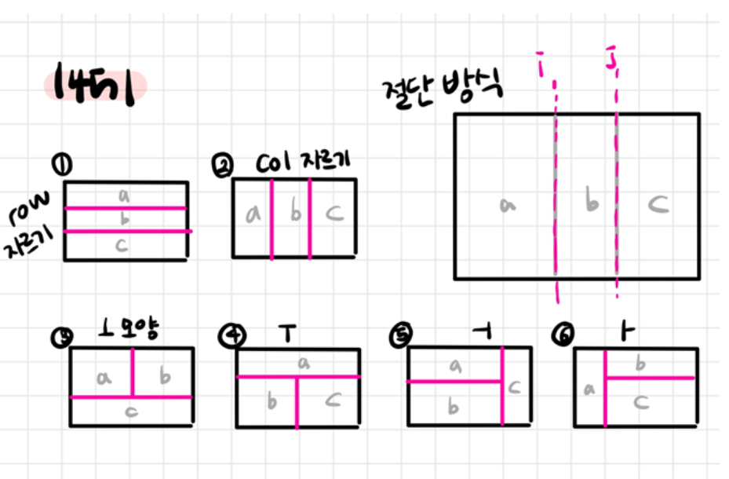
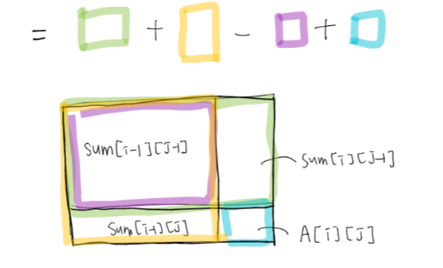
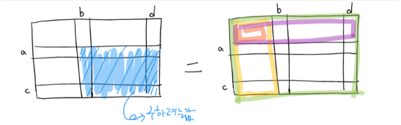

# 직사각형으로 나누기

### [문제 링크](https://www.acmicpc.net/problem/1451)

### 문제 풀이
이 문제는 직사각형을 3등분 하는 모든 경우를 찾는 문제이다. </br>
직사각형을 3등분 하는 방법은 아래 이미지와 같이 총 6가지가 있다. </br>


직사각형 3등분 6가지 방법

직사각형을 3등분 하는 6가지 방법을 이제 알았으니 각 직사각형의 합을 구하는 방법을 알아보자 </br>
직사각형의 행 열의 범위를 (1,1) ~ (N + 1,M +1) 라고 해보자  </br>
(1,1) ~ (i,j) 까지의 숫자 합을 구해보자. </br>
배열 Arr[N+1][N+1]은 직사각형의 값을 갖는다. </br>
Sum[i][j]  </br>
= (i,j) 까지의 숫자 합 </br>
= sum[i-1][j] + Sum[i][j-1] - Sum[i-1][j-1] + Arr[i][j] </br>
아래 그림을 통해 sum[i][j] 를 쉽게 이해해 보자.


그렇다면 특정 구역 (a, b) ~ (c, d)의 합을 구하는 방법을 알아보자 </br>
특정 구역의 합을 구하는 방법은 아래와 같다. </br>
Sum[c][d] - Sum[c][b-1] - Sum[a-1][d] + Sum[a-1][b-1]  </br>
이 공식은 3개로 나눈 직사각형의 넓이를 구하는 공식이다. </br>
아래 이미지를 통해 쉽게 이해해 보자.</br>


이제 직사각형의 값을 구하는 방법을 알았으니 답을 구해보자. </br>
직사각형을 3등분 하는 6가지 방법에 대한 코드는 아래 코드를 통하여 알아보자. </br>

### 소스 코드
```java
public class 직사각형으로_나누기 {
    static int[][] sum;
    static int[][] arr;
    static int N, M;
    public static void main(String[] args) {
        Scanner sc = new Scanner(System.in);
        String[] NM = sc.nextLine().split(" ");
        N = Integer.parseInt(NM[0]);
        M = Integer.parseInt(NM[1]);
        arr = new int[N + 1][M + 1];
        for (int i = 1; i < N + 1; i++) {
            String values = sc.nextLine();
            for (int j = 1; j < M + 1; j++) {
                arr[i][j] = values.charAt(j-1) - '0';
            }
//            System.out.println(Arrays.toString(arr[i]));
        }
        //sum[i][j] 구하기
        //이것은 1,1 ~ i,j 까지의 합을 나타냄
        //sum[i][j] = sum[i-1][j] + sum[i][j-1] - sum[i-1][j-1] + arr[i][j]
         sum = new int[N + 1][M + 1];
        for (int i = 1; i < N + 1; i++) {
            for (int j = 1; j < M+1; j++) {
                sum[i][j] = sum[i -1][j] + sum[i][j - 1] - sum[i-1][j-1] +  arr[i][j];
            }
//            System.out.println(Arrays.toString(sum[i]));
        }
        long answer = 0;
        //6가지 모양에 대한 넓이 구하기
        // 케이스 1번 col 자르기
        for(int i = 1; i <= M-2; i++){
            for(int j= i +1 ; j <= M-1; j++){
                long area1 = calArea(1,1,N,i);
                long area2 = calArea(1,i + 1,N,j);
                long area3 = calArea(1,j+1, N, M);
                if(answer < area1 * area2 * area3){
                    answer = area1 * area2 *area3;
                }
            }
        }
        //케이스 2번 row 자르기
        for(int i = 1; i <= N-2; i++){
            for(int j= i +1 ; j <= N-1; j++){
                long area1 = calArea(1,1,i,M);
                long area2 = calArea(i+1,1, j,M);
                long area3 = calArea(j + 1,1, N, M);
                if(answer < area1 * area2 * area3){
                    answer = area1 * area2 *area3;
                }
            }
        }
        //케이스 3번 'ㅏ' 자르기
        for(int i = 1; i <= N-1; i++){
            for(int j= 1 ; j <= M-1; j++){
                long area1 = calArea(1,1,N,j);
                long area2 = calArea(1,j + 1, i,M);
                long area3 = calArea(i + 1,j + 1, N, M);
                if(answer < area1 * area2 * area3){
                    answer = area1 * area2 *area3;
                }
            }
        }
        //케이스 4번 'ㅓ' 자르기
        for(int i = 1; i <= N-1; i++){
            for(int j = 1 ; j <= M-1; j++){
                long area1 = calArea(1,1,i,j);
                long area2 = calArea(i + 1,1, N,j);
                long area3 = calArea(1,j + 1, N, M);
                if(answer < area1 * area2 * area3){
                    answer = area1 * area2 *area3;
                }
            }
        }
        //케이스 5번 'ㅜ' 자르기
        for(int i = 1; i <= N-1; i++){
            for(int j = 1 ; j <= M-1; j++){
                long area1 = calArea(1,1,i,M);
                long area2 = calArea( i + 1,1, N,j);
                long area3 = calArea(i + 1,j + 1, N, M);
                if(answer < area1 * area2 * area3){
                    answer = area1 * area2 *area3;
                }
            }
        }
        //케이스 5번 'ㅗ' 자르기
        for(int i = 1; i <= N-1; i++){
            for(int j = 1 ; j <= M-1; j++){
                long area1 = calArea(1,1,i,j);
                long area2 = calArea( 1,j+ 1, i,M);
                long area3 = calArea(i+1,1, N, M);
                if(answer < area1 * area2 * area3){
                    answer = area1 * area2 *area3;
                }
            }
        }
        System.out.println(answer);
    }
    //(a, b) ~ (c, d) 넓이 구하기
    //sum[c][d] - sum[c][b-1] - sum[a-1][d] + sum[a-1][b-1]
    public static long calArea(int a, int b, int c, int d) {
        return sum[c][d] - sum[c][b-1] - sum[a-1][d] + sum[a-1][b-1];
    }
}

```

