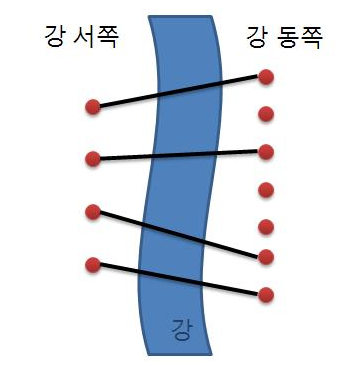

# 다리놓기 풀이

### [문제 링크](https://www.acmicpc.net/problem/1010)

### 문제 풀이
이 문제는 경우의 수를 구하는 문제이다.
</br>
이 문제는 다리가 서로 겹쳐서 설치할 수 없다는 점이 포인트이다.</br>
위 그림을 보면 4개의 다리가 겹치지 않고 설치된 것을 볼 수 있다.</br>
또한 그림을 보면 3개의 다리는 설치가 안 된것을 볼 수 있다.</br>
다리가 겹치지 않고 정렬된 모든 경우의 수를 구하기 위해선 현재 정렬되지 않은 3개의 다리가 
정렬된 다리 사이에 위치하는 모든 경우의 수가 된다.</br>
위 그림에 대한 연결된 다리의 모든 수를 구해보자 </br>
연결된 다리는 V, 연결되지 않은 다리를 o라고 하자.
연결된 다리 (서쪽 게이트의 수), 연결되지 않은 다리(동쪽 게이트 수 - 서쪽 게이트 수) 이다.
V=4가 되며 o는 3이 된다.
이것을 나열하면 'vvvvooo' 와 같이 되는 것을 볼 수 있다. 이 'vvvvooo'를 정렬하는 모든 경우의 수가 다리를 설치하는 모든 경우의 수가 된다.
즉 정답 = (동쪽 게이트 수)!/(서쪽게이트 수)!(동쪽 게이트 수 - 서쪽게이트 수)! 이 된다.


### 소스 코드
```java
public class 다리놓기 {
    public static void main(String[] args) {
        Scanner sc = new Scanner(System.in);
        int testCase = sc.nextInt();
        for (int i = 0; i < testCase; i++) {
            int sBridge = sc.nextInt();
            int eBridge = sc.nextInt();
            int restBridge = eBridge - sBridge;
            long answer = 1;
            int max = Math.max(restBridge, eBridge-restBridge);
            int min = Math.min(restBridge, eBridge-restBridge);
            for (int j = max + 1; j <= eBridge; j++) {
                answer *= j;
            }
            for (int j = 1; j <= min; j++) {
                answer /= j;
            }
            System.out.println(answer);
        }
    }
}

```